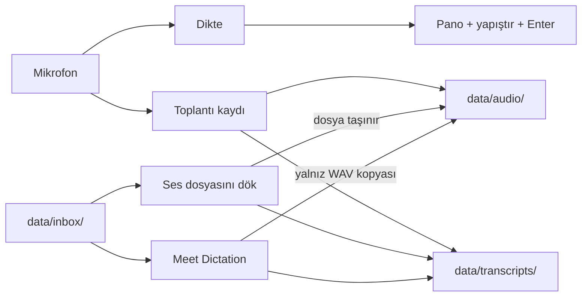

# VoiceDictation nasıl çalışır

Bu belge dört kullanım akışını, tray menüsünü, çıktı biçimini ve transkript temizliğini anlatır. Kurulum ve başlatma için [kurulum.md](kurulum.md), dosya konumları için [README → Yerel dosyalar](../README.md#yerel-dosyalar) bölümüne bak.

## Genel bakış

Uygulama, arka planda çalışan tek bir süreçtir (`dictation.py`). Mikrofonu sürekli dinler; dört akıştan birini başlatan komutu bekler.



| Akış | Başlatma | Kalıcı çıktı | Kaynak dosyaya ne olur |
|---|---|---|---|
| Dikte | F13 / Caps Lock x2 / "Diktasyon" | Yok (metin aktif pencereye gider) | — |
| Toplantı kaydı | Tray → 🎤 Toplantı → Başlat | `data/audio/<ad>.wav` + `data/transcripts/<ad>.md` | — |
| Ses dosyasını dök | Tray → 📁 veya `--transcribe FILE` | `data/transcripts/<dosya adı>.md` | `data/audio/` klasörüne **taşınır** |
| Meet Dictation | Tray → 🎥 | `data/audio/<ad>.wav` + `data/transcripts/<ad>.md` | **Dokunulmaz**, yerinde kalır |

## Dikte

Durum makinesi `LISTENING → RECORDING → PROCESSING → COOLDOWN → LISTENING` sırasıyla ilerler. Ses yalnız RAM'de tutulur ve metne çevrildikten sonra silinir.

1. **Başlat:** F13 (Windows) veya Caps Lock x2 (macOS) tuşuna bas ya da "Diktasyon" de. Kayıt sesi çalar, simge kırmızıya döner.
2. **Konuş:** Sessizlikte kayıt kendiliğinden gönderilmez. 30 saniye boyunca hiç konuşma algılanmazsa kayıt iptal olur.
3. **Bitir:** Aynı tuşa bas ya da tekrar "Diktasyon" de. Whisper turbo (`beam=3`) metne çevirir, temizlik uygulanır, metin panoya kopyalanır, aktif pencereye yapıştırılır ve Enter gönderilir.
4. **Bekleme:** 1,5 saniye sonra dinlemeye döner.

- **Tek nefes:** Wake word açıkken "Diktasyon <mesaj> Diktasyon" dersen mesaj doğrudan gönderilir.
- **Yalnız wake word:** Mesaj olmadan yalnız "Diktasyon" algılanırsa kayıt iptal edilir.
- **İptal:** Windows'ta F13'ü 1,25 saniye basılı tut; macOS'ta Caps Lock'a üç kez bas. Tray → ↺ Sıfırla da aynı işi yapar.
- **Wake word:** Varsayılan kapalıdır; Tray → ⚙ Ayarlar → Anahtar Kelime Dinleme ile açılır. "Anahtar Kelime: … (değiştir…)" ile başka bir kelime seçilebilir. Değişiklik yalnız RAM'de tutulur, yeniden başlatınca "diktasyon"a döner.

## Toplantı kaydı

Uzun kayıtlar (toplantı, ders) içindir. Kayıt sürerken F13 ve wake word yok sayılır, simge mor olur.

1. Tray → 🎤 Toplantı → **🎙 Toplantı Kaydı Başlat**.
2. **Canlı geçiş** paralel çalışır: 0,8 saniyelik sessizlik cümle sonu sayılır. Parçalar en az 3, en fazla 12 saniyedir; `beam=3` ile çevrilir.
   - Metin sistem temp klasöründeki `voicedictation_live/<zaman>_LIVE.md` dosyasına akar ve dosya editörde açılır.
   - VS Code'da `Ctrl+K V` önizlemeyi yan panelde açar.
3. Tray → 🎤 Toplantı → **⏹ Toplantı Kaydını Durdur**.
4. **Ad penceresi** açılır (Windows'ta tkinter, macOS'ta osascript). Boş bırakır ya da iptal edersen zaman damgası ad olur.
5. Kaydın tamamı `data/audio/<ad>.wav` olarak yazılır (16 kHz, mono, 16-bit PCM).
6. **Son geçiş** tüm sesi `beam=5` ile çevirir ve [temizlik katmanlarını](#transkript-temizliği) uygular.
7. Transkript `data/transcripts/<ad>.md` olarak yazılır ve editörde açılır.
8. Geçici `LIVE.md` silinir.

## Ses dosyasını dök

Mevcut bir ses veya video dosyasını yüksek kaliteyle (`beam=5`) transkripte çevirir.

- **Tray:** 🎤 Toplantı → **📁 Ses dosyasını dök…** Dosya seçici `data/inbox/` klasöründe açılır (Windows'ta tkinter, macOS'ta yerel osascript seçicisi).
- **Komut satırı:** `venv\Scripts\python dictation.py --transcribe FILE [--aggressive]`. Daemon açıkken reddedilir; önce Tray → Çıkış.
- **Biçimler:** `wav mp3 m4a aac flac ogg wma opus qta aif aiff caf`. Video dosyalarında (`mp4 mov mkv avi webm`) ses ayrılır.
- **Çözme:**
  - Windows'ta faster-whisper PyAV kullanır; sistemde ffmpeg gerekmez.
  - macOS'ta `afconvert` dosyayı 16 kHz mono PCM'e çevirir; ffmpeg gerekmez.
- **Çıktı:** Transkript `data/transcripts/<dosya adı>.md` olarak yazılır, ad sorulmaz. Kaynak dosya `data/audio/` klasörüne **taşınır** (zaten oradaysa yerinde kalır).

## Meet Dictation

Toplantı kayıtları (video dahil) içindir. Konuşmacı ayırma yapmaz; düz transkript üretir.

1. Tray → 🎤 Toplantı → **🎥 Meet Dictation…** Dosya seçici `data/inbox/` klasöründe açılır.
2. Ad penceresi açılır; varsayılan ad, dosyanın kendi adıdır.
3. Ses ayrılır ve `data/audio/<ad>.wav` olarak yazılır.
4. `beam=5` ile çevrilir, temizlik uygulanır.
5. Transkript `data/transcripts/<ad>.md` olarak yazılır (başlık: "Meet Dictation — <ad>") ve editörde açılır.
6. **Seçilen dosyaya dokunulmaz.** `data/inbox/` klasörünü Yiğit elle yönetir.

## iPhone ve mobil kayıtlar

iPhone Ses Kayıtları uygulaması, sıkıştırılmış ayarda `.m4a` (AAC), kayıpsız ayarda `.qta` (ALAC) üretir. İkisi de iki platformda doğrudan çözülür; dosyayı `data/inbox/` klasörüne bırakıp "dök" akışını kullan. macOS'ta Ses Kayıtları dosyaları uygulamadan sürükle-bırak ile dışarı alınır.

## Tray menüsü

Windows'ta sistem tepsisi (pystray), macOS'ta menü çubuğu (rumps). İki platformda da yapı aynıdır:

```text
Durum: <Hazır | Kayıt... | İşliyor... | Bekleme | 🟣 Toplantı Kaydı>
─────────────
🎤 Toplantı   ▸  🎙 Toplantı Kaydı Başlat  /  ⏹ Toplantı Kaydını Durdur
                 📁 Ses dosyasını dök...
                 🎥 Meet Dictation...
⚙ Ayarlar     ▸  🗣️ Anahtar Kelime Dinleme: Açık / Kapalı
                 ✏️ Anahtar Kelime: "diktasyon" (değiştir...)
─────────────
↺ Sıfırla
─────────────
Çıkış
```

Simge renkleri: yeşil hazır, kırmızı kayıt, sarı işleniyor, gri bekleme, mor toplantı.

## Çıktı biçimi

Her transkript aynı Markdown iskeletini kullanır:

```markdown
# <Başlık>

- **Tarih:** 2026-09-16 14:05:00
- **Ses suresi:** …
- **Model:** turbo (cuda)
- **Kaynak:** `data/audio/<ad>.wav`

---

**[00:00]** Yaklaşık 30 saniyelik paragraf…

---

_**Transkript tamamlandi.** Sure: … • Model: …_
```

- **Kaynak satırı:** Dosya repo içindeyse repo köküne göreli yol, repo dışındaysa mutlak yol yazılır. 16 Eylül 2026'dan önceki transkriptlerde eski mutlak yollar olduğu gibi kalır.
- **Ad çakışması:** Aynı adlı dosya varsa yeni dosyanın adına `_YYYYmmdd_HHMMSS` eklenir; hiçbir dosyanın üstüne yazılmaz.

## Transkript temizliği

Whisper sessizlikte ve gürültüde halüsinasyon üretebilir. Katmanlar, üretimden son metne doğru sırayla:

| Katman | Kapsam | Ne yapar | Varsayılan |
|---|---|---|---|
| VAD ön filtresi | Tümü | Sessiz bölümleri modele vermeden ayıklar (Windows'ta `vad_filter`, macOS'ta Silero `_vad_prefilter`) | Açık |
| `condition_on_previous_text=False` | Tümü | Önceki çıktının sonraki parçaya zincirleme tekrar taşımasını engeller | Açık |
| `_clean_transcription` | Dikte | Bilinen halüsinasyon kalıplarını ve tekrarları siler | Açık |
| `_drop_low_confidence_segments` | Toplantı, dosya | Düşük güvenli segmentleri atar (`no_speech_prob` > 0,6 ve `avg_logprob` < −1,0; ya da `compression_ratio` > 2,4) | Açık |
| `_strip_known_artifacts` | Toplantı, dosya | "Altyazı M.K." gibi kalıpları siler; gerçek "evet evet evet" cevaplarına dokunmaz | Açık |
| `_apply_word_corrections` | Tümü | Kronik yanlış yazımları düzeltir (Claude, Zugzwang, VoiceDictation …); kaynağı [kalibrasyon](calibration/README.md) | Açık |
| Dolgu sesi tekilleştirme | Toplantı, dosya | Art arda 3+ "Eee / Hım / Aa" tek örneğe iner | Açık |
| Agresif tekrar kırpma | Toplantı, dosya | 1–2 kelimelik bir cümle art arda 5+ kez geçerse tek örneğe iner | Kapalı; `--aggressive` ile açılır |

## Ayarlar

Ayarlar `dictation.py` içindeki sabitlerdir; ayar dosyası yoktur. Ortam değişkenleri README'de listelenir.

| Sabit | Değer | Etkisi |
|---|---|---|
| `MODEL_SIZE`, `LECTURE_MODEL_SIZE` | `"turbo"` | Whisper large-v3-turbo (macOS: `mlx-community/whisper-turbo`) |
| `WAKE_WORD_DEFAULT` | `"diktasyon"` | Varsayılan wake word |
| `INITIAL_PROMPT` | Terim listesi | Türkçe ve teknik kelimelere çözümleme önceliği |
| `SILENCE_THRESHOLD` | `0.008` | Dikte kaydında konuşma algılama eşiği |
| `NO_SPEECH_TIMEOUT` | `30.0` | Konuşmasız dikte kaydının iptal süresi (sn) |
| `LONG_PRESS_RESET` / `DOUBLE_TAP_INTERVAL` | `1.25` / `0.4` | Windows iptal basışı / macOS çift ve üçlü basış aralığı (sn) |
| `LECTURE_LIVE_VAD_THRESHOLD` | `0.025` | Toplantı canlı geçişinde cümle sonu eşiği; mikrofon gürültülüyse artır |
| `LIVE_SILENCE_DURATION` | `0.8` | Cümle sonu sayılan sessizlik (sn) |
| `LIVE_MIN_CHUNK_SECONDS` / `LIVE_MAX_CHUNK_SECONDS` | `3.0` / `12.0` | Canlı parça alt ve üst sınırı (sn) |
| `LECTURE_LIVE_BEAM_SIZE` | `3` | Canlı geçiş beam değeri |
| `LECTURE_AGGRESSIVE_CLEANUP` | `False` | Agresif tekrar kırpmanın varsayılanı |
| `LECTURE_CONF_NO_SPEECH`, `LECTURE_CONF_LOGPROB`, `LECTURE_CONF_COMPRESSION` | `0.6`, `-1.0`, `2.4` | Düşük güven filtresinin eşikleri |

**Editör seçimi** (toplantı ve Meet transkriptleri için): önce `VOICEDICTATION_EDITOR`, sonra VS Code (`code`), sonra sistem varsayılanı denenir. Hiçbiri açılamazsa dosya yolu panoya kopyalanır.

## Konuşmacı ayırma (kapalı)

speechbrain ECAPA ile konuşmacı ayırma kodu `dictation.py` içinde duruyor, ama tray'den çağrılmıyor. Gerekirse model `.local/models/` altına iner. Bu yol Meet kayıtlarında konuşmacıları yanlış kümelediği için kapatıldı. Yeniden açma planı [TODO.md](TODO.md) dosyasının "Gelecek" bölümünde.
